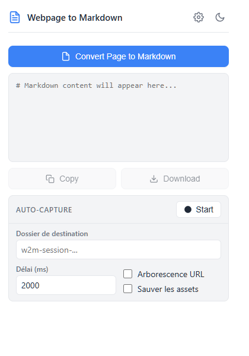
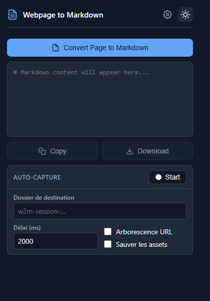
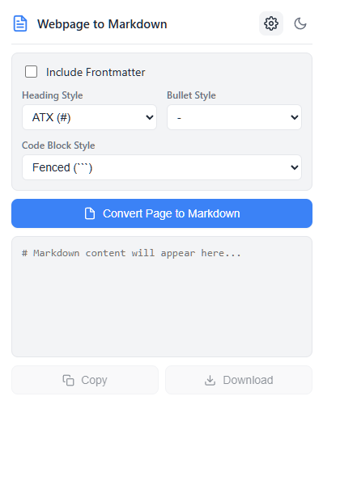
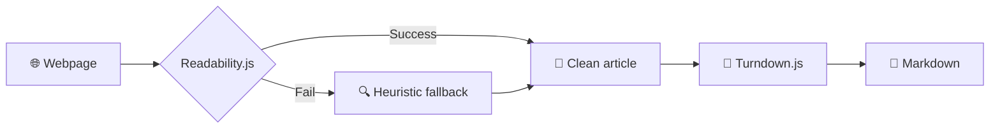

<p align="center">
  
</p>

<h1 align="center">🔄 Webpage to Markdown</h1>

<p align="center">
  <strong>Convert any webpage to clean Markdown — one click or full auto-pilot.</strong>
</p>

<p align="center">
  <a href="#-features">Features</a> •
  <a href="#-auto-capture">Auto-capture</a> •
  <a href="#-installation">Installation</a> •
  <a href="#-tech-stack">Tech Stack</a> •
  <a href="#-license">License</a>
</p>

<p align="center">
  
  
  
</p>

---

> 🍴 Forked from [Webpage to Markdown](https://chromewebstore.google.com/detail/webpage-to-markdown/ajeinonckioeekcfanjndliandidilid) — extended with auto-capture sessions, URL tree downloads, asset saving, and a redesigned UI.

---

## 📸 Screenshots

|                 Light Mode                 |                Dark Mode                 |                    Settings                    |
| :----------------------------------------: | :--------------------------------------: | :--------------------------------------------: |
|  |  |  |

---

## ✨ Features

### 📝 Manual Conversion

> Convert the current page to Markdown with a single click.

- 🖱️ **One-click conversion** — click the button, get your Markdown
- 📋 **Copy to clipboard** or 💾 **download as `.md`**
- ⚙️ Configurable heading style (ATX `#` / Setext), bullet style (`-` `*` `+`), code blocks (fenced / indented)
- 📄 Optional YAML frontmatter with title, URL, and date

---

### 🤖 Auto-capture

> Start a session, browse normally — every page you visit is automatically captured and saved.

```
┌─────────────────────────────────────────────────┐
│  🟢 Start session                               │
│  📂 Folder: my-docs/                            │
│  ⏱️  Delay: 2000ms                              │
│  🌳 URL tree: ✅    📦 Save assets: ✅          │
└─────────────────────────────────────────────────┘
        │
        ▼
   Browse normally...
        │
   ┌────┴────────────────────────────┐
   │  Page visited                   │
   │  ├─ 🟢 New page → capture + ✅ │
   │  └─ 🟠 Already seen → skip ⚡  │
   └─────────────────────────────────┘
        │
        ▼
┌─────────────────────────────────────────────────┐
│  🔴 Stop session                                │
│  📊 12 pages captured                           │
└─────────────────────────────────────────────────┘
```

| Feature                    | Description                                                                    |
| -------------------------- | ------------------------------------------------------------------------------ |
| 🌳 **URL Tree**            | Mirrors the URL path as folders: `example.com/docs/api/` → `docs/api/index.md` |
| 📦 **Save Assets**         | Downloads images locally and rewrites Markdown links to relative paths         |
| 💾 **Persistent State**    | Stop/restart without re-capturing already-visited pages                        |
| 🟠 **Duplicate Detection** | Orange flash on already-captured pages, green flash on new ones                |
| 📊 **Live Counter**        | Real-time count of captured pages in the popup                                 |
| ⏱️ **Configurable Delay**  | Wait for SPAs to finish loading before capturing (500ms–10s)                   |

---

### 🧠 Smart Content Extraction



- 📰 **Mozilla Readability.js** — robust article extraction used by Firefox Reader View
- 📊 **GFM tables** via turndown-plugin-gfm
- 🔗 Relative URLs resolved to absolute
- 💻 Code block language detection from `class` / `data-*` attributes
- 📂 `<details>`, `<summary>`, and `aria-label` support
- 🧹 Scripts, styles, and inline SVGs stripped clean

---

### 🎨 UI

- 🌙 Light / dark theme toggle
- ✨ Animated settings panel with smooth transitions
- 🔒 Inputs disabled during active session to prevent misconfiguration
- 🚫 No scrollbar — settings and capture panels swap seamlessly

---

## 📦 Installation

```bash
git clone https://github.com/qveys/webpage-to-markdown.git
```

1. Open Chrome → `chrome://extensions/`
2. Enable **Developer mode** (top right)
3. Click **Load unpacked** → select the cloned folder
4. 📌 Pin the extension to your toolbar

---

## 🔐 Permissions

|     Permission     | Why?                                  |
| :----------------: | ------------------------------------- |
|   🔓 `activeTab`   | Access current page content           |
|   💉 `scripting`   | Inject extraction scripts into pages  |
|    💾 `storage`    | Persist settings and session state    |
|   📥 `downloads`   | Save `.md` files and image assets     |
|     🔄 `tabs`      | Track tab navigation for auto-capture |
| 🧭 `webNavigation` | Detect page loads during sessions     |

---

## 🛠️ Tech Stack

|     | Technology                                                               | Role                          |
| :-: | ------------------------------------------------------------------------ | ----------------------------- |
| 🧩  | Chrome Extensions Manifest V3                                            | Extension platform            |
| 🔄  | [Turndown.js](https://github.com/mixmark-io/turndown)                    | HTML → Markdown conversion    |
| 📊  | [turndown-plugin-gfm](https://github.com/mixmark-io/turndown-plugin-gfm) | GFM tables support            |
| 📰  | [Readability.js](https://github.com/nicktomlin/nicktomlin.github.io)     | Content extraction            |
| 🟡  | Vanilla JavaScript                                                       | No framework, no dependencies |

---

## 📁 Project Structure

```
webpage-to-markdown/
├── 📄 manifest.json          # Extension manifest (V3)
├── 📄 popup.html             # Popup UI
├── 🎨 styles.css             # Popup styles (light/dark)
├── js/
│   ├── 🧠 background.js     # Service worker (sessions, downloads)
│   ├── 🖥️ popup.js           # Popup logic & UI
│   ├── 🔄 turndown.js        # Turndown.js library
│   └── 📊 turndown-plugin-gfm.js
├── img/
│   └── 🖼️ icon.png           # Extension icon
└── docs/
    └── screenshots/          # README screenshots
```

---

## 🤝 Contributing

Contributions welcome! Feel free to open an issue or submit a PR.

---

## 📄 License

MIT — free to use, modify, and distribute.

---

<p align="center">
  Made with ❤️ by <a href="https://github.com/qveys">@qveys</a>
</p>
