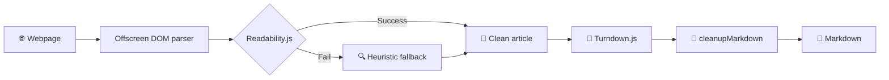

<p align="center">
  
</p>

<h1 align="center">🔄 Webpage to Markdown</h1>

<p align="center">
  <strong>Convert any webpage to clean Markdown — one click, auto-pilot, or full-site crawl.</strong>
</p>

<p align="center">
  <a href="#-features">Features</a> •
  <a href="#-crawl">Crawl</a> •
  <a href="#-installation">Installation</a> •
  <a href="#-tech-stack">Tech Stack</a> •
  <a href="#-license">License</a>
</p>

<p align="center">
  
  
  
</p>

---

> 🍴 Forked from [Webpage to Markdown](https://chromewebstore.google.com/detail/webpage-to-markdown/ajeinonckioeekcfanjndliandidilid) — extended with auto-capture sessions, multi-page crawl, side-panel dashboard, and a redesigned UI.

---

## ✨ Features

### 📝 Single-Page Conversion

> Convert the current page to Markdown with a single click.

- 🖱️ **One-click conversion** — click the button, get your Markdown
- 📋 **Copy to clipboard** or 💾 **download as `.md`**
- ⚙️ Configurable heading style (ATX `#` / Setext), bullet style (`-` `*` `+`), code blocks (fenced / indented)
- 📄 Optional YAML frontmatter with title, URL, and date

---

### 🤖 Auto-capture

> Start a session, browse normally — every page you visit is automatically captured and saved.

```
+-----------------------------------------------+
|  Start session                                |
|  Folder: my-docs/    Delay: 2000ms            |
|  URL tree: ON        Save assets: ON          |
+-----------------------------------------------+
                    |
                    v
            Browse normally...
                    |
        +-----------+--------------------------+
        |  Page visited                        |
        |  |-- New page  --> capture + save    |
        |  '-- Already seen --> skip (flash)   |
        +--------------------------------------+
                    |
                    v
+-----------------------------------------------+
|  Stop session       12 pages captured         |
+-----------------------------------------------+
```

| Feature                    | Description                                                                    |
| -------------------------- | ------------------------------------------------------------------------------ |
| 🌳 **URL Tree**            | Mirrors the URL path as folders: `example.com/docs/api/` → `docs/api/index.md` |
| 📦 **Save Assets**         | Downloads images locally and rewrites Markdown links to relative paths         |
| 💾 **Persistent State**    | Stop/restart without re-capturing already-visited pages                        |
| 🟠 **Duplicate Detection** | Orange flash on already-captured pages, green flash on new ones                |
| 📊 **Live Counter**        | Real-time count of captured pages in the popup                                 |
| ⏱️ **Configurable Delay**  | Wait for SPAs to finish loading before capturing (500 ms–10 s)                 |

---

### 🕷️ Crawl

> Give a starting URL, the extension discovers and converts every linked page automatically.

```
+-----------------------------------------------+
|  Start crawl: https://example.com/docs        |
|  Concurrency: 3      Depth: unlimited         |
|  Delay: 1000ms       Max blocks: 5            |
+-----------------------------------------------+
          |
          v
  +--------+---+---+---+---+
  | Worker |   1   2   3   |  (parallel fetch)
  +--------+---+---+---+---+
               |
    +--------------------------------------------+
    |  Response                                  |
    |  200     --> parse links + convert to .md  |
    |  403     --> add to blocked list           |
    |  CAPTCHA --> pause crawl                   |
    +--------------------------------------------+
          |
          v
  +-------+-----------------------------+
  |  Dashboard (side panel)             |
  |  |-- Live progress + activity log   |
  |  |-- Blocked URLs: retry / dismiss  |
  |  '-- Pause / Resume / Stop          |
  +-------------------------------------+
          |
          v
+-----------------------------------------------+
|  Crawl done       42 pages · 3 blocked        |
+-----------------------------------------------+
```

| Feature                      | Description                                                                 |
| ---------------------------- | --------------------------------------------------------------------------- |
| 🔗 **Automatic Discovery**   | Follows links within the same scope (domain / path prefix)                  |
| ⚡ **Concurrent Workers**    | Configurable concurrency (default 3) for parallel page fetching             |
| 🛡️ **Anti-bot Detection**   | Detects CAPTCHAs and 403/429 blocks, pauses automatically                  |
| 🔄 **Pause / Resume / Retry** | Full crawl lifecycle controls from popup and dashboard                     |
| 📊 **Live Dashboard**        | Side-panel with real-time progress, activity log, blocked URL management    |
| 🔍 **Debug Panel**           | Inspect captured pages, queue state, and crawl engine internals             |
| 💾 **State Persistence**     | Crawl survives Service Worker restarts via `chrome.storage`                 |
| 📏 **Depth Control**         | Limit crawl depth (0 = unlimited, or 1–5 levels)                           |

---

### 🧠 Smart Content Extraction



- 📰 **Mozilla Readability.js** — robust article extraction used by Firefox Reader View
- 📊 **GFM tables** via turndown-plugin-gfm
- 🔗 Relative URLs resolved to absolute
- 💻 Code block language detection from `class` / `data-*` attributes
- 📂 `<details>`, `<summary>`, and `aria-label` support
- 🧹 Scripts, styles, and inline SVGs stripped clean
- 🖼️ Small images constrained to rendered dimensions

---

### 🎨 UI

- 🌙 Light / dark theme toggle (shared across popup, dashboard, settings)
- 📊 Side-panel dashboard for crawl monitoring
- ⚙️ Dedicated settings page with markdown, capture, and crawl preferences
- 🔒 Inputs disabled during active session to prevent misconfiguration

---

## 📦 Installation

```bash
git clone https://github.com/qveys/webpage-to-markdown.git
```

1. Open Chrome → `chrome://extensions/`
2. Enable **Developer mode** (top right)
3. Click **Load unpacked** → select the cloned folder
4. 📌 Pin the extension to your toolbar

---

## 🔐 Permissions

|     Permission      | Why?                                                     |
| :-----------------: | -------------------------------------------------------- |
|   🔓 `activeTab`    | Access current page content                              |
|   💉 `scripting`    | Inject extraction scripts into pages                     |
|    💾 `storage`     | Persist settings, session state, and crawl progress      |
|   📥 `downloads`    | Save `.md` files and image assets                        |
|     🔄 `tabs`       | Track tab navigation for auto-capture                    |
| 🧭 `webNavigation`  | Detect page loads during sessions                        |
|   📊 `sidePanel`    | Dashboard side-panel for crawl monitoring                |
|   📄 `offscreen`    | Isolated DOM parsing for link extraction during crawl    |
|    ⏰ `alarms`      | Keep Service Worker alive during crawl sessions          |
| 🌐 `<all_urls>`     | Fetch and convert pages from any website during crawl    |

---

## 🛠️ Tech Stack

|     | Technology                                                               | Role                          |
| :-: | ------------------------------------------------------------------------ | ----------------------------- |
| 🧩  | Chrome Extensions Manifest V3                                            | Extension platform            |
| 🔄  | [Turndown.js](https://github.com/mixmark-io/turndown)                    | HTML → Markdown conversion    |
| 📊  | [turndown-plugin-gfm](https://github.com/mixmark-io/turndown-plugin-gfm) | GFM tables support            |
| 📰  | [Readability.js](https://github.com/mozilla/readability)                 | Content extraction            |
| 🟡  | Vanilla JavaScript                                                       | No framework, no dependencies |

---

## 📁 Project Structure

```
webpage-to-markdown/
├── manifest.json              # Extension manifest (V3)
├── popup.html                 # Popup UI
├── dashboard.html             # Side-panel crawl dashboard
├── settings.html              # Options page
├── offscreen.html             # Offscreen document (DOM parsing)
├── styles.css                 # Global styles (light/dark themes)
├── js/
│   ├── background.js          # Service Worker (sessions, downloads, crawl)
│   ├── popup.js               # Popup logic, state views, markdown converter
│   ├── dashboard.js           # Crawl dashboard UI and port communication
│   ├── crawl-engine.js        # CrawlEngine class (discovery, workers, anti-bot)
│   ├── settings.js            # Settings page controller
│   ├── settings-page.js       # Settings page bootstrap (theme toggle)
│   ├── app-state.js           # State machine (STATES, TRANSITIONS, AppState)
│   ├── i18n.js                # Internationalization (FR/EN)
│   ├── offscreen.js           # Offscreen DOM parser (link extraction)
│   ├── cleanup-markdown.js    # Shared markdown post-processing
│   ├── theme-icon.js          # Shared sun/moon theme icon builder
│   ├── theme-init.js          # Early theme detection (prevent flash)
│   ├── turndown.js            # Turndown.js (vendored)
│   ├── turndown-plugin-gfm.js # GFM plugin (vendored)
│   └── Readability.js         # Mozilla Readability (vendored)
├── img/
│   └── icon.png               # Extension icon
└── docs/
    └── screenshots/           # README screenshots
```

---

## 🤝 Contributing

Contributions welcome! Feel free to open an issue or submit a PR.

---

## 📄 License

MIT — free to use, modify, and distribute.

---

<p align="center">
  Made with ❤️ by <a href="https://github.com/qveys">@qveys</a>
</p>
