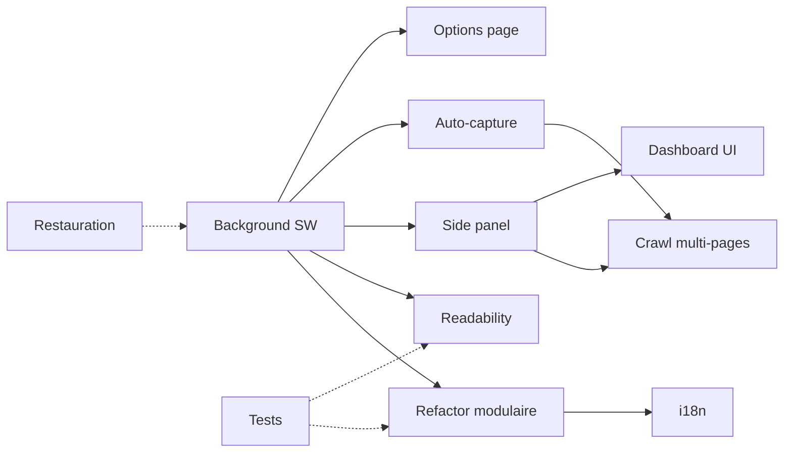

# Product Brief : Webpage to Markdown — État actuel vs direction cible

> **Issue** : [QUE-122](/QUE/issues/QUE-122)
> **Auteur** : 📊 Mary (Analyste Business)
> **Date** : 2026-06-15
> **Statut** : Brouillon — en attente de validation mainteneur
> **Baseline** : [QUE-118](/QUE/issues/QUE-118#document-baseline-technique)
> **Architecture** : [QUE-120](/QUE/issues/QUE-120#document-architecture-map)

---

## Résumé exécutif

L'extension **Webpage to Markdown v1.0.1** est une extension Chrome MV3 fonctionnelle et minimaliste qui convertit l'onglet actif en Markdown via extraction DOM + Turndown.js. Elle remplit son unique promesse : une conversion propre en un clic.

**La direction cible** — définie dans [QUE-117](/QUE/issues/QUE-117) — ambitionne d'en faire un outil de productivité complet : auto-capture, crawl multi-pages, dashboard side panel, extraction intelligente (Readability + Turndown). L'écart entre l'état actuel et cette cible est significatif mais comblable par une migration incrémentale.

**Le verrou principal** n'est pas fonctionnel mais architectural : l'absence de `background` service worker empêche toute orchestration long-vécue (sessions, crawl, notifications). La priorité n'est pas d'ajouter des features, mais de construire le socle qui les rendra possibles.

**Lecture estimée : 8 minutes.**

---

## État actuel

| Dimension | Constat |
|---|---|
| **Architecture** | Popup-only, pas de service worker, pas de content script déclaré |
| **Conversion** | Mono-page, déclenchée manuellement, extraction DOM one-shot |
| **Extraction** | Nettoyage basique (nav, footer, ads) + détection contenu principal (sélecteurs) |
| **Export** | Copie presse-papier, téléchargement `.md` |
| **Personnalisation** | Frontmatter, style titres, marqueurs liste, style code |
| **Stockage** | `localStorage` (settings/thème) + `chrome.storage.local` (dernière conversion) |
| **Turndown.js** | v7.x vendored — aucune modification upstream |
| **Readability** | **Absent** |
| **Tests** | Aucun |
| **i18n** | Anglais uniquement |
| **Permissions** | `activeTab`, `scripting`, `storage` — minimales, justifiées |

Forces : code propre, MV3, permissions minimales, zéro dépendance externe runtime.
Faiblesses : pas d'orchestrateur, pas de tests, pas d'internationalisation, Turndown non versionné.

---

## Direction cible (extraite de QUE-117)

| Feature cible | Présent | Priorité estimée |
|---|---|---|
| Conversion mono-page | ✅ Oui | — (à préserver) |
| Réglages / persistance | 🟡 Partiel | — (à enrichir) |
| Extraction intelligente (Readability + Turndown) | ❌ Non | **P1** |
| Sessions d'auto-capture | ❌ Non | **P2** |
| Dashboard side panel | ❌ Non | **P2** |
| Crawl multi-pages | ❌ Non | **P3** |
| Parsing DOM offscreen | ❌ Non | **P3** |
| Structure modulaire JS | 🟡 Partiel | P2 |

---

## Features cibles priorisées

### P1 — Socle (prérequis à tout le reste)

| Feature | Complexité | Dépend de | Débloque |
|---|---|---|---|
| **Background service worker** | M | Rien | Toutes les features long-vécues |
| **Refactor modulaire** | M | SW | Maintenabilité, testabilité |
| **Readability integration** | S | SW | Extraction intelligente |
| **Tests de non-régression** | M | Rien | Sécurité des refactors |

**Recommandation** : Ces 4 features peuvent être parallélisées en 2 tracks : (SW + modulaire) et (tests). Readability peut suivre dès que SW est en place.

### P2 — Productivité

| Feature | Complexité | Dépend de | Débloque |
|---|---|---|---|
| **Sessions d'auto-capture** | L | SW | Usage « capture et reviens plus tard » |
| **Dashboard side panel** | L | SW | UI persistante, historique, supervision |
| **i18n (français + anglais)** | S | Rien | Accessibilité marché FR |
| **Restauration dernière conversion** | XS | Rien | Quick win UX |
| **Options page (réglages avancés)** | S | SW | Configuration hors popup |

### P3 — Vision longue

| Feature | Complexité | Dépend de | Bloqueur |
|---|---|---|---|
| **Crawl multi-pages** | XL | SW + sessions + side panel | `host_permissions`, `webNavigation` |
| **Parsing DOM offscreen** | M | SW | Utilité à prouver |
| **Permissions étendues (alarms, tabs)** | — | SW | Dépend du scope crawl |

---

## Hypothèses et questions pour le mainteneur

### Questions de priorisation (3+ requises)

1. **Readability vs auto-capture en premier ?**
   - Scénario A : Readability d'abord → améliore la qualité du résultat existant immédiatement.
   - Scénario B : Auto-capture d'abord → débloque le cas d'usage « sauvegarde de pages de recherche » rapidement.
   - **Question** : Le besoin immédiat est-il une meilleure qualité de conversion (scénario A) ou un nouveau cas d'usage (scénario B) ?

2. **Side panel ou service worker d'abord ?**
   - Le CTO recommande SW d'abord (cf. [QUE-120](/QUE/issues/QUE-120#document-architecture-map)).
   - Une variante consisterait à déplacer l'UI existante dans un side panel ET d'y ajouter l'orchestration minimale, sans SW dédié dans un premier temps.
   - **Question** : Acceptez-vous la recommandation CTO (SW d'abord) ou préférez-vous un side panel avec orchestration intégrée comme première étape ?

3. **Dashboard ou auto-capture en premier dans l'UI ?**
   - Le dashboard side panel donne de la visibilité ; l'auto-capture donne une nouvelle capability autonome.
   - **Question** : Quelle expérience utilisateur souhaitez-vous prioriser après le socle technique : la visibilité (dashboard) ou l'automatisation (capture) ?

### Hypothèses marquées

- **[H1]** Les iframes cross-origin ne sont pas accessibles et ne le seront jamais. *Confiance : élevée.*
- **[H2]** Firefox/Edge ne sont pas ciblés pour la V2. *Confiance : faible — à confirmer.*
- **[H3]** Le public cible est technique (développeurs, rédacteurs techniques). *Confiance : moyenne — inféré du README.*
- **[H4]** Le volume de données stockées par session restera sous 10 Mo. *Confiance : faible — non vérifié.*

---

## Dépendances entre features



**Légende** : Flèche pleine = dépendance forte. Pointillés = dépendance faible ou parallélisable.

---

## Recommandation d'ordre d'implémentation

```text
Phase 0 (quick wins, sans risque) :
  └─ Restauration dernière conversion (XS, 1h)
  └─ Tests de non-régression (M, 2-3j)

Phase 1 (socle technique) :
  └─ Background service worker (M, 3-5j)
  └─ Refactor modulaire (M, 2-3j, parallélisable avec SW)

Phase 2 (valeur métier) :
  └─ Readability integration (S, 2j)
  └─ Selon validation mainteneur :
      ├─ Auto-capture (L, 5-8j)
      └─ Ou Side panel dashboard (L, 5-8j)

Phase 3 (vision) :
  └─ Crawl multi-pages (XL, 10-15j)
  └─ Parsing offscreen (M, 3-5j, si justifié)
```

---

## Questions ouvertes pour le mainteneur

En complément des questions de priorisation ci-dessus :

1. **Plateformes cibles** : Chrome uniquement ou Chrome + Firefox + Edge ?
2. **Public** : Plutôt développeurs ou plutôt grand public ?
3. **Stockage** : `chrome.storage.local` suffit ou faut-il prévoir `chrome.storage.sync` ou un export cloud ?
4. **Volume** : Quelle est l'utilisation attendue (quelques conversions par jour, ou centaines) ?
5. **Gouvernance** : Souhaitez-vous une publication Chrome Web Store à chaque phase, ou un rythme moins fréquent ?

---

## Prochaine étape

Ce product brief est prêt pour la **validation par le mainteneur**. Une fois les priorités confirmées, John (PM) pourra produire le **PRD** détaillé pour chaque feature en Phase 2 BMAD.

**Actions requises :**

1. Le mainteneur répond aux questions de priorisation ci-dessus.
2. Les réponses alimentent le PRD (Phase 2, par John).
3. Les décisions d'architecture sont tranchées par le CTO (Winston) en Phase 3.
