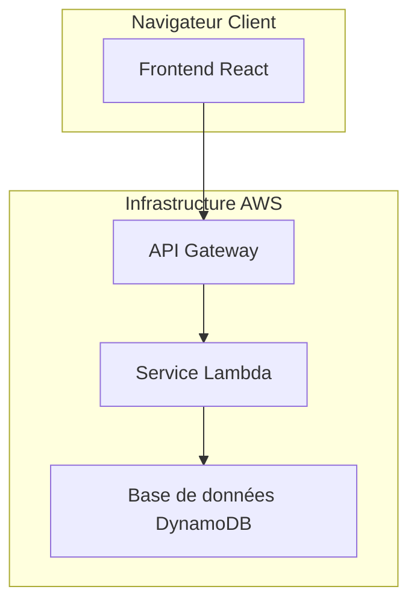
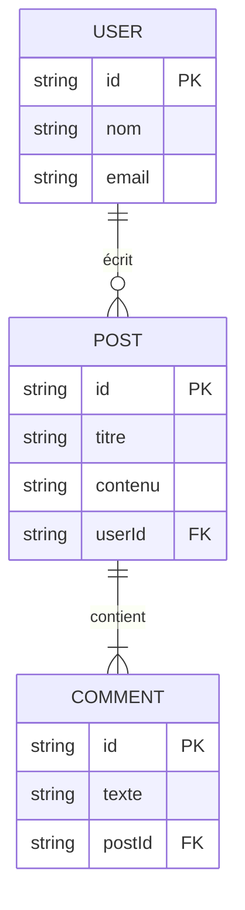

> **Issue** : [LIEN-VERS-ISSUE](/PREFIX/issues/ISSUE-ID)
> **Auteur** : [Votre Nom] (Architecte)
> **Date** : AAAA-MM-JJ
> **Statut** : Brouillon | En revue | Validé
> **PRD** : [LIEN-VERS-PRD](/PREFIX/issues/ISSUE-ID#document-key)

---

## 1. Vue d'ensemble et objectifs

_**Objectif** : Décrire les buts de ce document d'architecture. Quels problèmes techniques résolvons-nous ? Quelles sont les contraintes (budget, temps, technologie existante) ?_

**Objectifs de l'architecture** :

- _Ex: Concevoir un système capable de supporter 10 000 utilisateurs concurrents._
- _Ex: Mettre en place une architecture modulaire pour faciliter les évolutions futures._
- _..._

**Contraintes** :

- _Ex: Doit être déployé sur AWS._
- _Ex: Doit réutiliser le système d'authentification existant._
- _..._

---

## 2. Diagramme d'architecture de haut niveau

_**Objectif** : Fournir une vue d'ensemble visuelle du système._



---

## 3. Décomposition des composants

_**Objectif** : Décrire chaque composant du diagramme ci-dessus._

- **Frontend React**
  - **Rôle** : _Interface utilisateur principale._
  - **Technologies** : _React, TypeScript, Redux._
  - **Responsabilités** : _..._

- **API Gateway**
  - **Rôle** : _Point d'entrée pour toutes les requêtes API._
  - **Responsabilités** : _Authentification, routage, limitation de débit._

- **Service Lambda**
  - **Rôle** : _Logique métier principale._
  - **Technologies** : _Node.js, TypeScript._
  - **Responsabilités** : _..._

- **Base de données DynamoDB**
  - **Rôle** : _Stockage des données utilisateur._
  - **Schéma** : _..._

---

## 4. Modèle de données

_**Objectif** : Décrire la structure des données principales._



---

## 5. Spécification des APIs (si applicable)

_**Objectif** : Définir les contrats d'interface entre les services._

**Endpoint** : `POST /users`

- **Description** : _Crée un nouvel utilisateur._
- **Request Body** :

  ```json
  {
    "name": "string",
    "email": "string"
  }
  ```

- **Response (201 Created)** :

  ```json
  {
    "id": "string",
    "name": "string",
    "email": "string"
  }
  ```

---

## 6. Choix technologiques et justifications

_**Objectif** : Justifier les décisions techniques importantes._

| Technologie | Choix | Justification | Alternatives considérées |
|---|---|---|---|
| **Base de données** | DynamoDB | _Scalabilité, performance, intégration avec Lambda._ | _PostgreSQL, MongoDB_ |
| **Langage Backend** | Node.js | _Écosystème riche, performance pour les I/O._ | _Python, Go_ |
| **...** | _..._ | _..._ | _..._ |

---

## 7. Déploiement et Infrastructure

_**Objectif** : Décrire comment le code sera build, testé et déployé._

- **CI/CD** : _GitHub Actions_
- **Environnements** : _Développement, Staging, Production_
- **Stratégie de déploiement** : _Blue/Green, Canary..._

---

## 8. Considérations transverses

_**Objectif** : Aborder les aspects non fonctionnels critiques._

- **Sécurité**
  - _Authentification (ex: JWT), Autorisation (ex: RBAC)._
  - _Protection contre les attaques communes (XSS, CSRF, Injection SQL)._
- **Performance**
  - _Stratégies de mise en cache._
  - _Objectifs de temps de réponse._
- **Scalabilité**
  - _Comment le système va-t-il monter en charge ? (ex: Auto-scaling des Lambdas)._
- **Observabilité**
  - _Logging (ex: CloudWatch Logs)._
  - _Monitoring (ex: CloudWatch Metrics)._
  - _Tracing (ex: AWS X-Ray)._

---

## 9. Risques et plans de mitigation

_**Objectif** : Anticiper les problèmes potentiels._

| Risque | Probabilité (Faible/Moyenne/Élevée) | Impact (Faible/Moyen/Élevé) | Plan de mitigation |
|---|---|---|---|
| _Ex: La dépendance X devient obsolète_ | Moyenne | Élevé | _Allouer du temps pour la migration vers Y._ |
| _..._ | _..._ | _..._ | _..._ |

---

## 10. Prochaine étape

- **Ce document est prêt pour la création du plan d'implémentation par le Tech Lead.**
