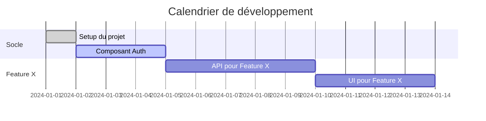

> **Issue** : [LIEN-VERS-ISSUE](/PREFIX/issues/ISSUE-ID)
> **Auteur** : [Votre Nom] (Tech Lead / CTO)
> **Date** : AAAA-MM-JJ
> **Statut** : Brouillon | En revue | Validé
> **Architecture Document** : [LIEN-VERS-ARCHITECTURE](/PREFIX/issues/ISSUE-ID#document-key)

---

## 1. Résumé du projet

_**Objectif** : Fournir un résumé rapide du projet pour l'équipe de développement._

---

## 2. Équipe et rôles

_**Objectif** : Lister les membres de l'équipe et leurs responsabilités sur ce projet._

| Nom | Rôle |
|---|---|
| _..._ | _Développeur Backend_ |
| _..._ | _Développeur Frontend_ |
| _..._ | _QA_ |

---

## 3. Décomposition des tâches

_**Objectif** : C'est la liste des tâches concrètes à réaliser. Chaque tâche devrait idéalement correspondre à un ticket dans le système de suivi (Jira, Paperclip, etc.)._

- **Épopée 1: [Titre de l'épopée]**
  - **[TICKET-ID-1]** Tâche 1 (Estimation: 2 jours)
    - Sous-tâche 1.1
    - Sous-tâche 1.2
  - **[TICKET-ID-2]** Tâche 2 (Estimation: 3 jours)
    - ...
- **Épopée 2: [Titre de l'épopée]**
  - ...

---

## 4. Calendrier et jalons

_**Objectif** : Donner une vue d'ensemble du calendrier du projet._

### Jalons clés
- **Jalon 1 (AAAA-MM-JJ)** : _Ex: Socle technique terminé et déployé en staging._
- **Jalon 2 (AAAA-MM-JJ)** : _Ex: Feature X entièrement fonctionnelle pour une démo interne._
- **Jalon 3 (AAAA-MM-JJ)** : _Ex: Déploiement en production._

---

## 5. Stratégie de test

_**Objectif** : Décrire comment la qualité du logiciel sera assurée._

- **Tests unitaires** : _Chaque nouvelle fonction doit être couverte par des tests unitaires._
- **Tests d'intégration** : _Les interactions entre les services A et B seront testées._
- **Tests de bout en bout (E2E)** : _Les scénarios utilisateurs critiques seront automatisés avec [Outil E2E]._
- **Tests manuels** : _Une passe de QA manuelle sera effectuée avant chaque mise en production._

---

## 6. Plan de release

_**Objectif** : Expliquer comment le logiciel sera livré aux utilisateurs._

- **Fréquence des releases** : _Ex: Toutes les deux semaines._
- **Processus de release** :
  1. _Merge sur la branche `master`._
  2. _Déploiement automatique sur l'environnement de staging._
  3. _Validation par le Product Owner._
  4. _Déploiement manuel en production._

---

## 7. Prochaine étape

- **L'équipe de développement peut commencer à travailler sur les tâches définies dans ce plan.**
