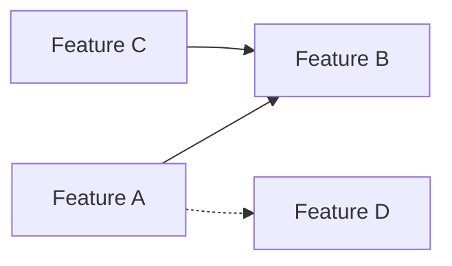

> **Issue** : [LIEN-VERS-ISSUE](/PREFIX/issues/ISSUE-ID)
> **Auteur** : [Votre Nom] ([Votre Rôle])
> **Date** : AAAA-MM-JJ
> **Statut** : Brouillon | En revue | Validé
> **Baseline** : [LIEN-VERS-BASELINE](/PREFIX/issues/ISSUE-ID#document-key)

---

## 1. Résumé exécutif

_**Objectif** : Fournir une vue d'ensemble rapide (moins de 2 minutes de lecture) du problème, de la solution proposée et de la recommandation principale. C'est la section la plus importante pour les décideurs._

**Le problème** : Décrivez succinctement le problème que vous essayez de résoudre. Quel est le pain point actuel ?

**La direction cible** : Expliquez la vision à long terme. Où voulons-nous aller ?

**Le verrou principal** : Quel est le principal obstacle (technique, produit, ressource) qui nous empêche d'atteindre la cible ?

**Recommandation** : Quelle est l'action la plus importante à entreprendre maintenant ?

---

## 2. État actuel

_**Objectif** : Fournir un aperçu factuel et neutre de la situation actuelle. Utilisez des tableaux et des listes pour une lecture facile._

| Dimension | Constat |
|---|---|
| **Architecture** | _Ex: Popup-only, pas de service worker..._ |
| **Fonctionnalité X** | _Ex: Mono-page, déclenchée manuellement..._ |
| **Fonctionnalité Y** | _Ex: Nettoyage basique, pas d'IA..._ |
| **Stockage** | _Ex: `localStorage` uniquement..._ |
| **Tests** | _Ex: Aucun, couverture de 15%..._ |
| **...** | _Ajoutez autant de dimensions que nécessaire._ |

**Forces** : Listez les points positifs de la situation actuelle.
**Faiblesses** : Listez les points négatifs ou les risques.

---

## 3. Direction cible

_**Objectif** : Détailler la vision. Quelles sont les fonctionnalités ou les améliorations que nous voulons construire ?_

| Feature cible | Présent dans l'état actuel ? | Priorité estimée |
|---|---|---|
| _Ex: Extraction intelligente_ | ❌ Non | **P1** |
| _Ex: Dashboard central_ | 🟡 Partiel | **P2** |
| _Ex: Conversion multi-pages_ | ✅ Oui | — |
| _..._ | _..._ | _..._ |

---

## 4. Features cibles priorisées

_**Objectif** : Décomposer la vision en blocs de travail réalisables et les prioriser. Utilisez une analyse de dépendances pour justifier l'ordre._

### P1 — Socle (les prérequis)

| Feature | Complexité (XS/S/M/L/XL) | Dépend de | Débloque |
|---|---|---|---|
| _..._ | _..._ | _..._ | _..._ |

**Recommandation** : Suggérez une stratégie de parallélisation si possible.

### P2 — Productivité (la valeur ajoutée rapide)

| Feature | Complexité | Dépend de | Débloque |
|---|---|---|---|
| _..._ | _..._ | _..._ | _..._ |

### P3 — Vision longue (les grands chantiers)

| Feature | Complexité | Dépend de | Débloque |
|---|---|---|---|
| _..._ | _..._ | _..._ | _..._ |

---

## 5. Hypothèses et questions pour le mainteneur/décideur

_**Objectif** : Lister les incertitudes et poser des questions claires pour obtenir les arbitrages nécessaires._

### Questions de priorisation

1. **Question 1 ?**
    - Scénario A : ...
    - Scénario B : ...
    - **Question** : Faut-il choisir A ou B ? Pourquoi ?

2. **Question 2 ?**
    - ...

### Hypothèses marquées

- **[H1]** _Ex: Le public cible est technique._ | _Confiance : élevée/moyenne/faible._
- **[H2]** _Ex: Le volume de données restera faible._ | _Confiance : faible — à confirmer._
- **[H3]** _..._

---

## 6. Dépendances entre features (Optionnel)

_**Objectif** : Visualiser les dépendances pour mieux comprendre les priorités._



**Légende** : Flèche pleine = dépendance forte. Pointillés = dépendance faible.

---

## 7. Recommandation d'ordre d'implémentation

_**Objectif** : Proposer un plan de déploiement par phases._

```text
Phase 0 (Quick wins) :
  └─ ...

Phase 1 (Socle technique) :
  └─ ...

Phase 2 (Valeur métier) :
  └─ ...
```

---

## 8. Questions ouvertes

_**Objectif** : Lister toutes les autres questions qui nécessitent une réponse pour avancer._

1. ...
2. ...

---

## 9. Prochaine étape

_**Objectif** : Clarifier qui doit faire quoi après la lecture de ce document._

**Actions requises :**

1. Le mainteneur/décideur répond aux questions.
2. Les réponses alimenteront le [PRD](/PREFIX/issues/ISSUE-ID#document-key).
3. ...
