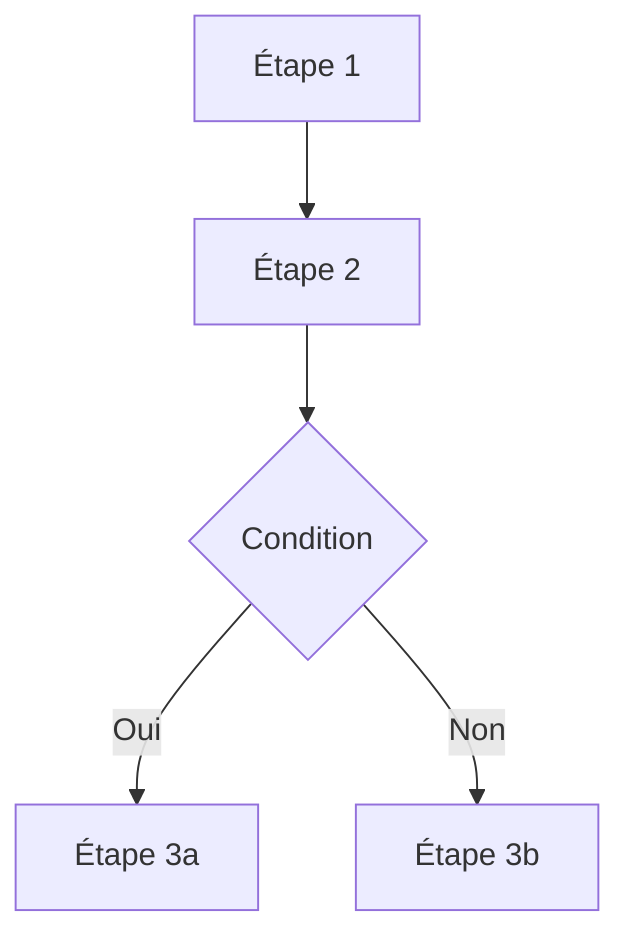

> **Document**: [LIEN-VERS-ISSUE](/PREFIX/issues/ISSUE-ID) — Inventaire technique et baseline
> **Auteur**: [Votre Nom] ([Votre Rôle])
> **Date**: AAAA-MM-JJ
> **Version du produit analysé**: [Ex: 1.0.1]

---

## 1. Identité du produit/projet

_**Objectif** : Fournir les informations d'identification de base du projet._

| Champ | Valeur |
|---|---|
| **Nom** | _..._ |
| **Version** | _..._ |
| **Description** | _..._ |
| **Licence** | _..._ |
| **URL de déploiement** | _..._ |

### Git

- **Commits** : _Nombre de commits_
- **Remote** : _URL du remote ou "non configurée"_

---

## 2. Inventaire des fichiers

_**Objectif** : Lister les fichiers clés du projet et leur rôle. Ne listez pas tout, concentrez-vous sur les fichiers importants._

| Fichier/Dossier | Rôle |
|---|---|
| `src/` | _Code source de l'application_ |
| `package.json` | _Dépendances et scripts_ |
| `README.md` | _Documentation projet_ |
| `...` | _..._ |

---

## 3. APIs et services externes utilisés

_**Objectif** : Lister les dépendances externes critiques (APIs, services SaaS, etc.)._

| API/Service | Usage | Localisation dans le code |
|---|---|---|
| _Ex: `chrome.tabs.query()`_ | _..._ | _..._ |
| _Ex: API Stripe_ | _..._ | _..._ |

---

## 4. Permissions et justification (si applicable)

_**Objectif** : Pour les extensions navigateurs, applications mobiles, etc., lister les permissions demandées et pourquoi._

| Permission | Justification | Critique ? (Oui/Non) |
|---|---|---|
| _..._ | _..._ | _..._ |

---

## 5. Analyse des dépendances clés

_**Objectif** : Mettre en lumière une ou deux dépendances majeures, leur version et leur état._

**Bibliothèque** : _Nom de la bibliothèque_
**Version identifiée** : _Version_
**Type** : _Ex: via npm, vendored (copié-collé)_
**Upstream** : _Lien vers le dépôt GitHub/site officiel_
**Modifications locales** : _Oui/Non_

---

## 6. Architecture et flux de données principal

_**Objectif** : Expliquer visuellement ou textuellement le flux de travail le plus important de l'application._

_Ou décrivez le flux en étapes :_

1. **Étape 1** : ...
2. **Étape 2** : ...
3. ...

---

## 7. Comportements observables (scénarios de test de base)

_**Objectif** : Lister quelques scénarios d'utilisation clés qui devraient toujours fonctionner. Cela sert de base pour les tests de non-régression._

| # | Scénario | Comportement attendu |
|---|---|---|
| 1 | _Ex: Inscription utilisateur_ | _L'utilisateur reçoit un email de confirmation_ |
| 2 | _Ex: Conversion de page_ | _Le contenu principal est extrait et converti_ |
| 3 | ... | ... |

---

## 8. Dépendances externes complètes

_**Objectif** : Lister toutes les dépendances de production._

| Dépendance | Version | Source |
|---|---|---|
| _..._ | _..._ | _..._ |

---

## 9. Observations architecturales

_**Objectif** : Partager une analyse critique de l'architecture actuelle._

### Forces

- _Ex: Conforme aux standards X_
- _Ex: Code propre et bien structuré_
- _..._

### Faiblesses / Risques

- _Ex: Pas de service worker, logique couplée à l'UI_
- _Ex: Pas de tests automatisés_
- _..._

### Pistes de dette technique

- _Ex: La dépendance X devrait être mise à jour_
- _Ex: Le module Y devrait être refactorisé_
- _..._

---

## 10. Conclusion et recommandations

_**Objectif** : Résumer l'état technique du projet._

**Conclusion** : _Ex: Le projet est fonctionnel mais manque de tests et d'une architecture évolutive._

**Prochaine étape recommandée** : _Ex: Ce document sert de baseline pour le PRD._

**Niveau de confiance** : _Élevé/Moyen/Faible (à quel point cette analyse est-elle complète ?)_
